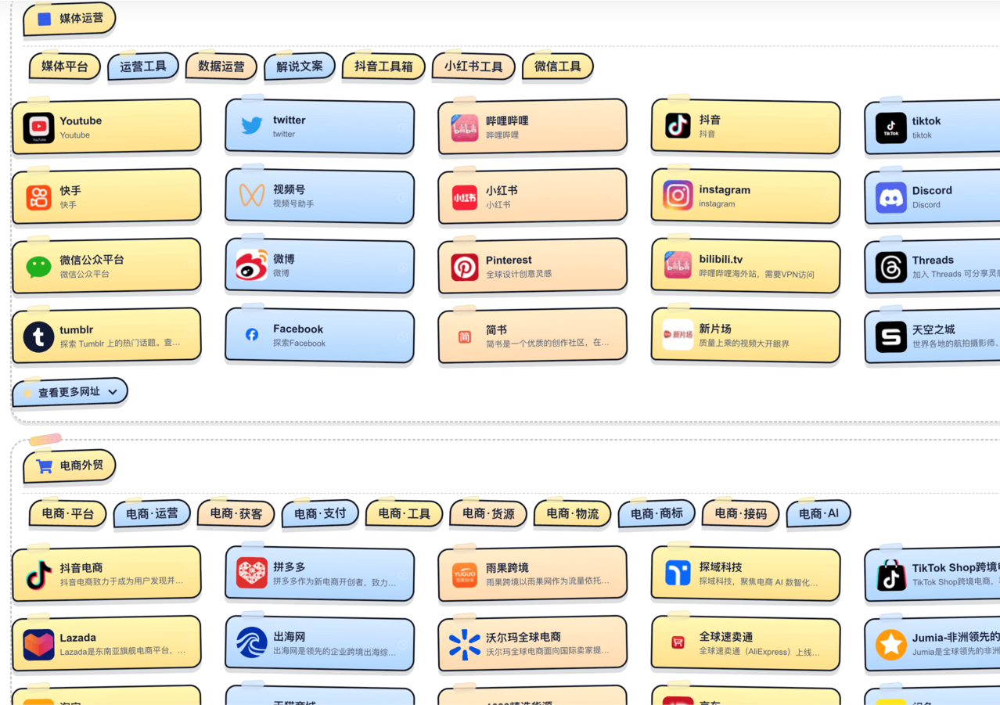

# Noisedh-Nav

## 一个可前后端分离带扩展一键收藏的hugo框架导航，可以通过简单配置配合不同的组件效果打造专属的导航网站

|  |  |
| :----------------------------------------------------------: | ------------------------------------------------------------ |
|                      |  |

## 特征

- 个性化多组件自定义配置，站点头部组件可手动更换及调整
- 内置搜索、收录统计、一键下载为浏览器书签
- 全新的loading载入效果，带有自定义文本果冻动画
- 友好的seo及meta配置，修改config.toml即可
- 带有二级分类横向页签的展示及更多网址的展示折叠
- 全新带有AI一键分析推荐分类的扩展，随时随地收藏你的网址
- 强大的后端API，多种部署方式，支持Docker一键部署
- 后端带有轻量化后台管理，支持一键站点配置、失效检测、网站管理智能添加

## 文档目录

- 浏览器扩展（收录/搜索/AI）：[USAGE.md](./extension/Nav-manage-extension/USAGE.md)
- 后端 API（Docker/参数/API）：[DEPLOYMENT.md](./extension/yaml-server/DEPLOYMENT.md)
- 扩展与后端总览：[extension/README.md](./extension/README.md)
- Docker 整站部署（Hugo 主题网站）：[DOCKER_HUGO.md](./DOCKER_HUGO.md)
- 扩展在线安装：[点击访问](https://microsoftedge.microsoft.com/addons/detail/nav-manage/pogpiicgclbpchehmdgdeianhgpnjanl)
- 独立扩展+后端开源仓库：[点击访问](https://github.com/rcy1314/nav-manage)

------


## 文章（归档页）字段规范

归档页会读取文章 Front Matter 与 Hugo 计算字段，用于展示时间与标签等元信息。建议统一使用 YAML/TOML Front Matter。

### 可选（均非必填）

- `title`：文章标题；未填写时 Hugo 会自动用文件名生成标题
- `date`：发布时间（建议带时区，例如 `2026-05-24T20:00:00+08:00`）；未填写时归档/文章页不会显示发布时间
- `draft`：是否草稿（`true/false`）；未填写时默认 `false`

### 推荐

- `lastmod`：更新时间（更新后请同步改这个字段；当同时填写 `date` 且 `lastmod > date` 时显示“更新”徽章）
- `tags`：标签数组（归档页展示为 `#tag` 徽章）

YAML 示例：

```
---
title: "示例文章"
date: 2026-05-24T20:00:00+08:00
lastmod: 2026-05-25T10:30:00+08:00
tags: ["hugo", "导航", "主题"]
draft: false
---
```


后端后台入口：/admin 密码为自定义设置的api token


注：已在主题文件夹保留不同版本：V1版本更简洁,V2版本为重构后的贴纸风格主题，如果你想使用v1，请替换对应的config.toml

## 快速开始（前后端分离 / 仅后端）

本仓库包含 Hugo 站点（主题）+ 后端 API + 浏览器扩展。常见部署方式：

## 部署前端

使用GitHub\Netlify\vercel\等直接选择hugo框架部署即可

本地：使用Hugo命令直接生成静态网站

### 仅部署后端（已有 Hugo 站点源码目录）

```bash
docker run -d \
  --name nav-manage \
  -p 8990:8990 \
  -e PORT=8990 \
  -e BASE_DIR=/app/hugo \
  -e API_TOKEN=change_me_to_a_strong_token \
  -e ENABLE_HUGO=false \
  -e REMOTE_UPDATE_WEBHOOK= \
  -v /path/to/your/hugo-site:/app/hugo \
  --restart=always \
  noise233/nav-manage:latest
```

如果你还希望同时启用 MCP（供 AI 客户端接入，自然语言站内搜索/可点击翻页），可以这样启动：

```bash
docker run -d \
  --name nav-manage \
  -p 8990:8990 \
  -e PORT=8990 \
  -e BASE_DIR=/app/hugo \
  -e API_TOKEN=change_me_to_a_strong_token \
  -e MCP_TOKEN=change_me_to_a_mcp_token \
  -e MCP_REQUIRE_TOKEN=true \
  -e MCP_RATE_LIMIT_MAX=120 \
  -e MCP_RATE_LIMIT_WINDOW_MS=60000 \
  -e ENABLE_HUGO=false \
  -e MCP_HTTP=true \
  -v /path/to/your/hugo-site:/app/hugo \
  --restart=always \
  noise233/nav-manage:latest
```

AI 客户端接入（URL 方式，最少配置）：

```json
{
  "mcpServers": {
    "NOISE导航": {
      "url": "https://<你的域名或IP>:8990/mcp",
      "headers": {
        "Authorization": "Bearer <Token>"
      }
    }
  }
}
```

鉴权说明（/mcp）：

- 默认需要鉴权：`Authorization: Bearer <Token>`
- `Token` 的取值优先级：`MCP_TOKEN`（若设置）→ 否则复用 `API_TOKEN`
- 若希望公开给所有人使用：设置 `MCP_REQUIRE_TOKEN=false`（不再需要 Authorization）

传输说明（/mcp）：

- HTTP 端点统一为 `/mcp`
- 支持标准 MCP HTTP 的 `GET` / `POST` / `DELETE`
- 服务端会根据客户端请求头返回单次 JSON 响应或 `text/event-stream`
- 初始化后，服务端可能返回 `Mcp-Session-Id`，客户端后续请求应继续携带

访问频率限制（/mcp，按 IP 计数）：

- `MCP_RATE_LIMIT_MAX`：窗口内最大请求数（默认 120）
- `MCP_RATE_LIMIT_WINDOW_MS`：窗口毫秒数（默认 60000）
- `MCP_RATE_LIMIT_DISABLED=true`：关闭限制

公开模式示例（不需要 Token，但保留访问频率限制）：

```bash
docker run -d \
  --name nav-manage \
  -p 8990:8990 \
  -e PORT=8990 \
  -e BASE_DIR=/app/hugo \
  -e ENABLE_HUGO=false \
  -e MCP_HTTP=true \
  -e MCP_REQUIRE_TOKEN=false \
  -e MCP_RATE_LIMIT_MAX=120 \
  -e MCP_RATE_LIMIT_WINDOW_MS=60000 \
  -v /path/to/your/hugo-site:/app/hugo \
  --restart=always \
  noise233/nav-manage:latest
```

使用示例（自然语言 / 格式化）：

- 自然语言： “在 NOISE导航 里搜一下 AI 工具，翻到第 2 页”
- 自然语言： “帮我找可以 AI 生成图片的网站”
- 自然语言： “在 NOISE导航 里搜一下 AI 绘图工具”
- 自然语言： “找一些支持文生图的站点”
- 自然语言： “搜索能生成图片的 AI 网站，优先国外热门产品”
- 自然语言： “帮我找 AI 图片生成工具，第 2 页”
- 自然语言： “在 NOISE导航 里搜一下：云盘资源库（可以命中描述）”
- 格式化： “搜索：关键词=AI，页码=2，每页=20”
- 带筛选： “搜索：关键词=AI，一级分类=设计，二级分类=图标”
- 结构化： “搜索：关键词=AI，格式=json”（需要完整字段时用）

字段映射（数据文件真实字段；其中 taxonomy/term 可作为筛选参数）：

- `一级分类` → `taxonomy`
- `二级分类` → `term`
- `地址` → `url`
- `描述` → `description`

### 后端 API 一键部署到 Railway

- 仓库已内置 Railway 配置文件 [railway.json](file:///Library/Github/noisedh/railway.json)
- 在 Railway 选择 `Deploy from GitHub repo` 并选择本仓库即可自动按 Dockerfile 部署后端 API
- 至少配置变量：`API_TOKEN`、`BASE_DIR`（建议 `/app/hugo`）、`ENABLE_HUGO=false`
- 部署后可用 `https://<你的域名>/api/health` 验证服务存活

要让“收录后自动更新站点”，二选一：

- `ENABLE_HUGO=true`：在容器内直接执行 `hugo`（需要挂载完整 Hugo 源码目录）
- `ENABLE_HUGO=false` + `REMOTE_UPDATE_WEBHOOK=<你的更新入口>`：写入完成后触发远程构建/发布

后端常用环境变量（完整列表见 DEPLOYMENT.md）：

- `PORT`：服务端口（默认 8990）
- `BASE_DIR`：Hugo 站点根目录（包含 `data/`、`content/`、`themes/`、`config.toml`）
- `API_TOKEN`：鉴权 Token（扩展 `serverToken` 必须一致；未设置时写入类接口不可用）
- `ENABLE_HUGO`：是否在后端直接执行 `hugo`
- `REMOTE_UPDATE_WEBHOOK`：触发远程构建/发布的 webhook（可选）
- `INVALID_404_THRESHOLD`：失效链接连续 404 删除阈值（默认 3）
- `INVALID_CHECK_TIMEOUT_MS`：失效检测请求超时（默认 8000）
- `INVALID_LINKS_MD`：失效归档输出文件（默认 `${BASE_DIR}/content/invalidlinks.md`）
- `INVALID_LINKS_COUNTS`：404 计数持久化文件（默认 `extension/yaml-server/invalidlink_counts.json`）
- `MCP_HTTP=true`：开启 MCP 的 HTTP 接入（统一使用 `/mcp` 端点；完整见 DEPLOYMENT.md）
- `MCP_REQUIRE_TOKEN=true|false`：`/mcp` 是否必须携带鉴权 Token（默认 true）
- `MCP_TOKEN`：`/mcp` 的鉴权 Token（可选；不填则复用 `API_TOKEN`）
- `MCP_RATE_LIMIT_MAX` / `MCP_RATE_LIMIT_WINDOW_MS`：`/mcp` 访问频率限制（按 IP 计数）

### 前后端分离（推荐）

- Hugo 站点：静态发布在 Nginx / CDN / GitHub Pages
- 后端 API：部署在云服务器，仅负责写入 `data/*.yml` 与触发更新
- 浏览器扩展：配置 `serverUrl` + `serverToken`（必须等于后端 `API_TOKEN`）

扩展常用配置项（在扩展“设置”页）：

- 云服务器：`serverUrl`、`serverToken`、开启“云端写入”
- GitHub：`githubUser/githubRepo/githubBranch/githubPath/githubToken`、开启“GitHub 写入”
- AI：`aiProvider/aiModelName/aiApiKey/aiEndpoint`、可选开启“AI 摘要自动转中文”

更完整的步骤与参数说明请查看上面的文档链接。

### Docker 整站部署（Hugo 主题网站）

如果你希望直接把 Hugo 主题站点完整跑起来（含 Nginx 静态服务），或同时联动 `yaml-server`，请使用整站教程：

- [DOCKER_HUGO_THEME_DEPLOY.md](file:///Library/Github/noisedh/DOCKER_HUGO_THEME_DEPLOY.md)
- 覆盖场景：仅 Hugo+Nginx、Hugo+Nginx+yaml-server、生产安全建议与排错

它是在WebStack-Hugo二次开发下的软编码改造实现，可以纯静态化部署，使用前请查看如下说明：

仓库给出的是直接hugo整站的代码，包含主题文件，所以你可以直接使用hugo命令来生成导航网站（前提是已安装过hugo）

安装Hugo：https://hugo.opendocs.io/installation/

## 测试安装 

在安装Hugo之后，通过以下命令来测试安装是否成功：

```sh
hugo version
```

你应该能看到类似如下的输出：

```text
hugo v0.105.0-0e3b42b4a9bdeb4d866210819fc6ddcf51582ffa+extended linux/amd64 BuildDate=2022-10-28T12:29:05Z VendorInfo=snap:0.105.0
```

## 显示可用命令 

要查看可用命令和标志的列表：

```sh
hugo help
```

要获取关于子命令的帮助，请使用`--help`标志。例如：

```sh
hugo server --help
```

## 构建站点 

要构建站点，请进入项目目录并运行以下命令：

```sh
hugo
```

Docker 方式构建（无需本机安装 Hugo）：

```bash
docker run --rm -v "$PWD":/src -w /src klakegg/hugo:0.128.2-ext hugo --minify
```

## 更新

- 优化图标加载逻辑，同时增加了https://favicon.im/zh/ 自动读取网站图标
- 增加页面强制刷新的提示弹窗和相关按钮
- 修复切换分类时默认加载logo不显示的问题
- 修复文章页默认样式模糊效果，优化加载速度
- 优化二级分类文本样式

## 配置

在config.toml设置（先查看带有#的注释说明）

默认tag页面、音乐组件、广告位组件、seo设置、右下角折叠菜单、头部导航tag页自定义、公告组件、热榜组件、b站视频收藏组件

示例数据：config.toml请自行修改

网站分类及数据文件-位于data文件夹下

```
data
├── friendlinks.yml # 友情链接
├── headers.yml     # 顶部导航
└── webstack.yml    # 网址列表
```

格式请直接打开文件查看

content文件夹为页面文档夹，默认样式文件为`themes/noisedh-nav/layouts/_default/single.html`

链接跳转页为`themes/noisedh-nav/themes/noisedh-nav/static/redirect.html`

可在186行加入可跳转的网址白名单和黑名单

## 自定义魔改

主题文件夹：layouts为所有模版文件夹，_default为hugo渲染的md文章页样式模版，partials为主题样式模版

partials主模版：component_header为头部组件模版，content_footer为网址模块子级页脚模版，content_header为网址模块子级头部模版，content_main为网址模块父级模版，sidebar为侧边栏模版，notification_component为通知组件模版，footer及header为父级页脚及头部

## 组件配置

### 说说页面

部署：https://github.com/rcy1314/echo-noise

### 热榜组件

配置：hot.css+hot.js 配置可在config.toml设置api，如果你想要更多热榜，请在hot.js增加相关热榜接口，参考：https://docs.noisework.cn/guide/index/hotlist

### 头部自定义页

除了默认页面和热榜页面，其它所有 tab 都可以通过下面示例增加（支持内嵌及写入html）

```
{ key = "mab", icon = "fa-star", label = "主页", iframeHeight = "400px", iframeWidth = "100%",iframeUrl = "https://www.noisework.cn" },
```


```
{ key = "custom", icon = "fa-code", label = "自定义", html = "<div style=\"color:white; text-align:center;\">这里是自定义HTML内容</div>" },
```

### rss聚合阅读组件源

仓库地址：https://github.com/rcy1314/rss-server-ag

- 支持docker一键部署，支持fly.io等平台部署

```
docker run -d \
  --name rss-server-ag \
  -p 3000:3000 \
  -e PORT=3000 \
  -e RSS_URLS="https://example.com/rss1.xml,https://example.com/rss2.xml" \
  -e ADMIN_API_KEY=your_admin_key \
  noise233/rss-server-ag
```
